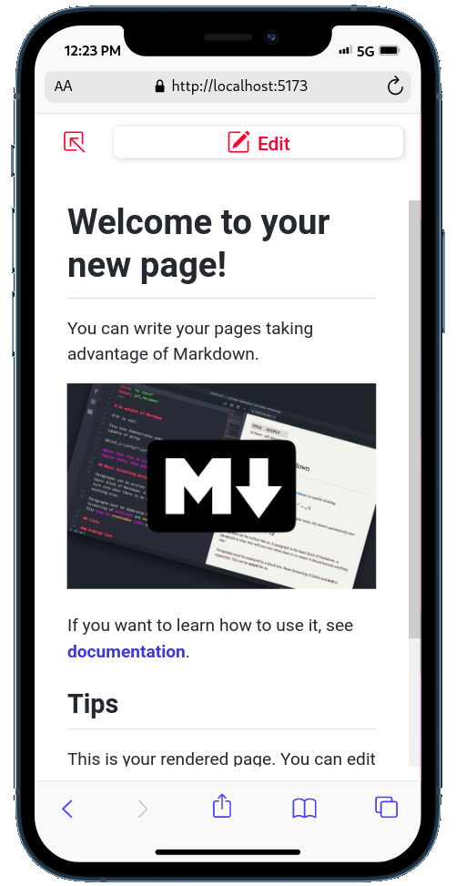

<h1 align="center">
  <br />
  <a href="https://www.canva.com/design/play?category=tACFapY0WQc&referrer=banners-landing-page">
    </a>
</h1>

<p align="center">
  <a href="https://www.djangoproject.com/" style="padding-right: 15px">
    
  </a>

  <a href="https://react.dev/">
    
  </a>
</p>

## Description

This project consists in a note-taking app, designed and implemented using Django with JWT Authentication and React as a JavaScript library.

## Technologies

- **Backend**
  - Python
  - Django
  - Django Rest Framework
  - Django Cors Headers
  - Django Rest Framework Simple JWT
- **Frontend**
  - Vite
  - ReactJS
  - React Router Dom
  - Axios
  - React Toastify

## Design

This project is implemented to be mobile responsible.

<h3 style="padding: 3px 0; font-size: 20px; text-align: center; border-bottom: 2px solid #cccccc">Homepage</h3>

<p align="center">
     <span style="padding-right: 15px; border-radius: 7px">
       
     </span>

  <span>
    
  </span>
</p>

<h3 style="padding: 3px 0; font-size: 20px; text-align: center; border-bottom: 2px solid #cccccc"">Authentication</h3>

<p align="center">
     <span style="padding-right: 15px">
       
     </span>

  <span>
    
  </span>
</p>

<p align="center">
     <span style="padding-right: 15px">
       
     </span>

  <span>
    
  </span>
</p>

<h3 style="padding: 3px 0; font-size: 20px; text-align: center; border-bottom: 2px solid #cccccc"">Dashboard</h3>

<p align="center">
     <span style="padding-right: 15px">
       
     </span>

  <span>
    
  </span>
</p>

<p align="center">
     <span style="padding-right: 15px">
       
     </span>

  <span>
    
  </span>
</p>

<h3 style="padding: 3px 0; font-size: 20px; text-align: center; border-bottom: 2px solid #cccccc">Boards</h3>

<p align="center">
     <span style="padding-right: 15px">
       
     </span>

  <span>
    
  </span>
</p>

<h3 style="padding: 3px 0; font-size: 20px; text-align: center; border-bottom: 2px solid #cccccc">Books</h3>

<p align="center">
    <span style="padding-right: 15px">
        
    </span>
    <span>
        
    </span>
</p>

<h3 style="padding: 3px 0; font-size: 20px; text-align: center; border-bottom: 2px solid #cccccc">Dialogs</h3>

<p align="center">
  <span>
    
  </span>
  
  <span>
    
  </span>
</p>

<h3 style="padding: 3px 0; font-size: 20px; text-align: center; border-bottom: 2px solid #cccccc">Settings</h3>

<p align="center">
     <span style="padding-right: 15px">
       
     </span>

  <span>
    
  </span>
</p>

## Configuration

You'll need to set up the email **user** and **password** to use this project.

In your project folder `notetaker`, open the `.env` file and modify the last two lines:

- `EMAIL_USER="your_email_here@host.com"`
- `EMAIL_PASSWORD="your_password_here"`

After that, you're ready to go!

## How To Use

To clone and run this application, you'll need [Git](https://git-scm.com/downloads) and [Docker](https://docs.docker.com/get-started/08_using_compose/) installed on your computer.

In your command line:

**Clone this repository**

```bash
git clone https://github.com/sammanthaps/notetaker.git
```

**Go into the repository**

```bash
cd notetaker
```

**Run Docker container**

```bash
docker compose up -d
```

**Go to the server**

```bash
http://localhost:5173/
```
